.. TCC userguide documentation master file, created by
   sphinx-quickstart on Thu Jul  2 13:32:52 2020.
   You can adapt this file completely to your liking, but it should at least
   contain the root `toctree` directive.

###############################
TCC Web Application: User guide
###############################

.. toctree::
   :maxdepth: 2
   :caption: Contents:

************
Introduction
************

*****************************
TCC APPLICATION CONFIGURATION
*****************************
**!This doc is a test for creating a user guide. Edit this out when entire doc draft is finished.!**

The TCC application behavior is controlled through these
configuration Pages:

1. The Campus Configuration page
2. The device/criteria configuration page
3. The Agent Configuration page
4. The *Inputs* page
5. The *Outputs* page
6. The *Schedule* page 

Importing the Master Driver Configuration Store
***********************************************
At the initial homepage, the user will be prompted to upload the **Master Driver Configuration Store** file.
Values within the Master Driver Configuration Store will be parsed to provide options for Campus, Building, 
Time Zone and Points throughout the application.

.. image:: _images/master_Driver.JPG

Once the user has selected the Master Driver Configuration Store, this homepage will not appear again. However, if the user needs to upload a different Master Driver Configuration Store at any point, this option can be accessed via the Menu icon in the top left of the application.

.. Warning:: Uploading a new Master Driver Configuration Store will remove all current data in the application.

Campus Configuration
********************

When a Master file has been uploaded, the application will go into the *Campus Configuration*
page. The first selections that will be shown are the *Campus*, *Building*, and *Time Zone* dropdown's. 

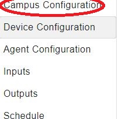

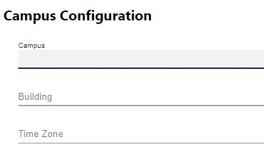

**Campus**
The campus name as published by the VOLTTRON
platform.driver service.

**Building**
The building name as published by the VOLTTRON
platform.driver service.

**Time Zone**
Time Zone has default strings implemented into the program.

Device Configuration
********************

*Device Configuration* is the second page in the list of main configuration pages.
Once this page is selected, there will be a list of items with dropdown options shown in the center. 

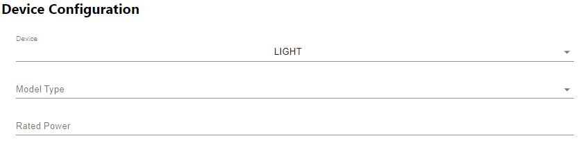

There are 4 different selections with device. When the device drop down is selected, these 
4 items will be shown:

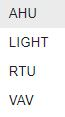

After a Device is chosen, there is an option below it to choose the model type. 
The two options will be *First Order Zone* and *Simple*. Once an option of these are chosen,
the option will be stored inside of the JSON code.

.. image:: _images/simple_First.JPG

The last value(s) will be determined based upon the device chosen. This list will go over
each of the different options the device configurations will go over. 

**AHU**

*AHU*'s configuration starts with the *Equipment Configuration*. There are 3 check boxes shown at
the start of the config. The first one being *Has an economizer*, second: *Building Chiller*, and third: 
*Variable Volume*.

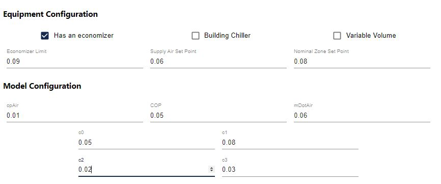

.. Note:: Each of these check boxes are stored as boolean values. If checked, it will be stored as "True" or 1. 
   if unchecked, it will be stored as "false" or 0.

under the check boxes there is 3 items: *Economizer limit*, *Supply Air Set Point*, and 
*Nominal Zone Set Point*. All of these items take in a float based value. 

Model Configuration is another option that will be available upon selection of the 
*AHU* Device. Inside of *Model Configuration* there are a selection oh inputs to use. 
*cpAir*, *COP*, *mDotAir*, *c0*, *c1*, *c2*, and *c3*. These inputs take in a float value as 
well. They will be shown inside the Model configuration of the
Device configuration JSON code.

**Light**

light is the second selection of the device list inside of *Device Configuration*. 
Once light is selected, There will be a new dropdown located at the bottom of the items list called
*Rated Power*.

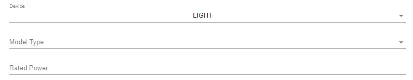

*Rated Power* Takes in a float value to store.

**RTU**

*RTU* is the third selection of the device list inside of *Device Configuration*.
Once *RTU* is selected, there will be a new selection of items to insert info.

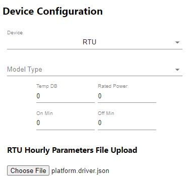

There are 4 options to input float values into.
*Temp DB*, *Rated Power*, *On Min*, and *Off Min*.

Below these inputs is *RTU Hourly Parameters File Upload*.
This will allow a file to be uploaded into.

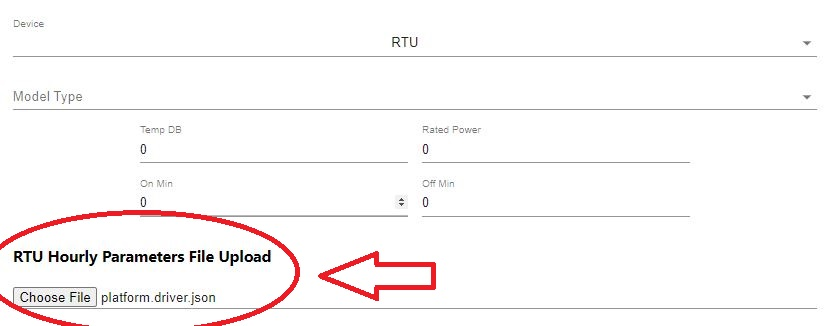

**VAV**

*VAV* is the last item on the device list inside of *Device Configuration*.
When *VAV* is selected, there will be a new selection of items to insert info. 

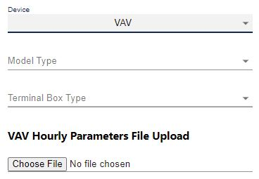

The VAV will add a new drop down called Terminal Box Type. This will produce a list
option of *CAV* or *VAV* within the dropdown.

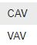

The *VAV* Device Configuration will also allow an *Hourly Parameters File Upload*. This will be 
located at the bottom of the page.

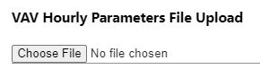

Agent Configuration
*******************

*Agent Configuration* is the third page in the TCC config tool.

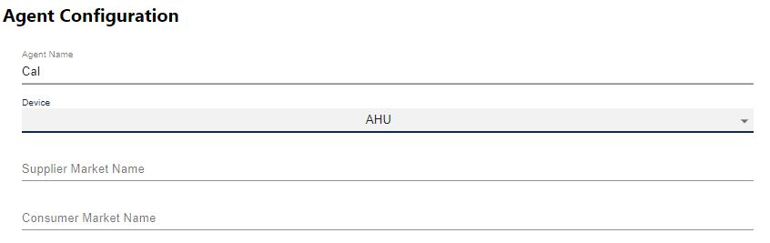

Within Agent Configuration, the first prompt will be to add an Agent Name.

the second prompt within Agent Configuration will be *device*. This will include
a dropdown list of items: *AHU*, *Light*, *RTU*, and *VAV*.

After selecting an item in devices, there will be different input options
depending on what is selected.

**AHU**

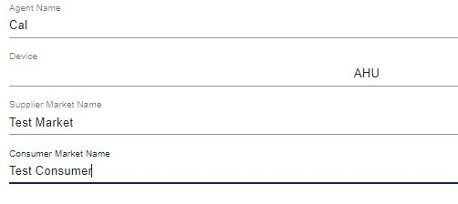

When *AHU* is selected in Agent Configuration 
there will be 2 new options to input into. 
The first one is *Supplier Market Name*
and the second one is *Consumer Market Name*.
 
**Light**

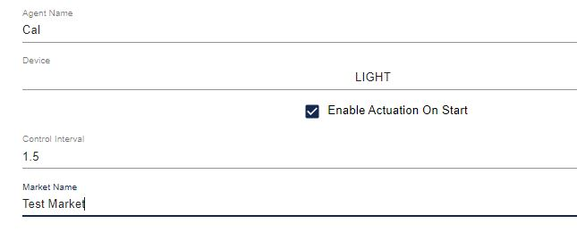

Light will be the second item in the dropdown. Once *light* is selected 
there will be a checkbox below the dropdown that says: *Enable Actuation On Start*.

.. Note:: This checkbox is represented as a boolean value. When checked it will be stored as 
   "true" in Json. When unchecked it will be considered "false".

Below the checkbox, there are 2 more items: *Control Interval* and *Market Name*.
Control interval will take in items of a float value, and Market Name will take in a 
string item. 

**RTU**

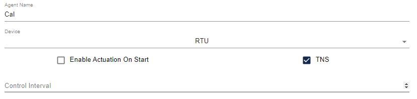

RTU is the third item in the dropdown selection list. This item, once selected, will place
2 checkboxes below the list. The two checkboxes are *Enable Actuation On Start* and *TNS*. 

.. Note:: These checkboxes are represented as a boolean value. When checked they will be stored as 
   "true" in Json. When unchecked it will be considered "false".

Below the two checkboxes, there is an option called *Control Interval*. This takes in items of
a float value.

**VAV**

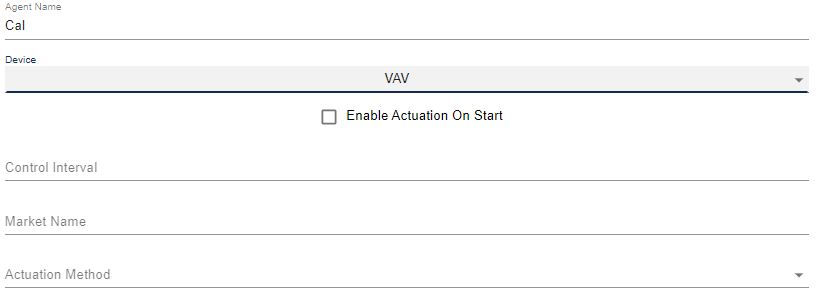

*VAV* is the last item on the list in *Devices* for the Agent Configuration page. 

Underneath the device list, there is a checkbox to select called *Enable Actuation On Start*.

.. Note:: This checkbox is represented as a boolean value. When checked it will be stored as 
   "true" in Json. When unchecked it will be considered "false".

Below the checkbox, there are 3 items: *Control Interval*, *Market Name*, and *Actuation Method*.

within *Control Interval*, it will take in an item of a float value. *Market Name* takes 
in a string. *Actuation Method* has an additional dropdown to choose from. 

Inputs
******

*Inputs* is the fourth page in the TCC application. Inside of the *Inputs* page the first thing
is that, automatically, the first input there is is named *Input 0*. There is also the option to remove
or reset this input as well. In the top right of the *Inputs* page, there is a red button called *remove*. This 
will remove the selected input that you want to remove. 

**Topic** 

The first tab you will see in the *Inputs* page is *Topic*. 

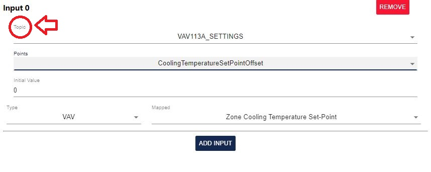

inside of *Topic* there is a dropdown list. The dropdown list will be determined based upon the 
*Main Configuration File*. Once an option is chosen, different *Points* in the Points tab will be available based upon the 
Topic chosen.

**Point**

Points change based on the topic that is selected. 
The points that will be displayed are the ones that are stored 
within that device's data structure that is passed in the 
platform.driver.store file.

In the first example the topic will be: *VAV213C_SETTINGS*

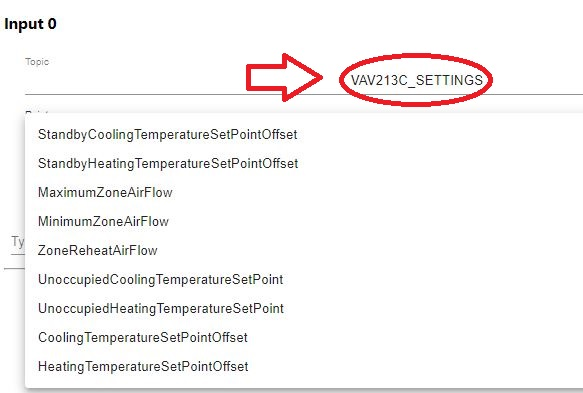

The second example the topic will be: *METERS*

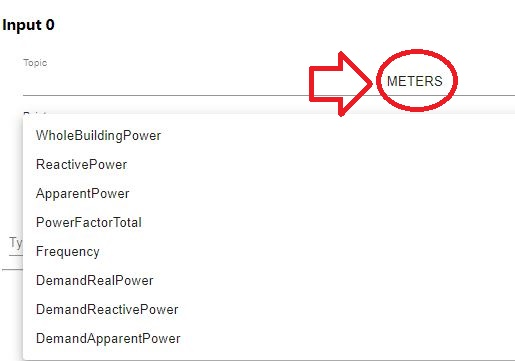

Below Points there is the tab: *Initial Value*. 
This tab will take in a float number as a value. 

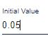

The last tab of the *Inputs* page is *Type*. Type has an initial dropdown 
which consists of *AHU*, *Light*, and *VAV*. Next to the Type part of the tab
there is *mapped*. mapped will have a different selection inside the dropdown 
depending on the *Type* selected. 

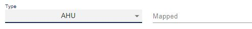

Outputs
*******

**Topic**

The *Outputs* page is the fifth page in the TCC application. Inside of the *Outputs* page the first thing
is that, automatically, the first item there is is named *Output 0*. There is also the option to remove
or reset this input as well. 

In the top right of the *Outputs* page, there is a red button called *remove*. This 
will remove the selected input that you want to remove. 

inside of *Topic* there is a dropdown list. The dropdown list will be determined based upon the 
*Main Configuration File*. Once an option is chosen, different *Points* in the Points tab will be available based upon the 
Topic chosen.

**Point**

Points change based on the topic that is selected. 
The points that will be displayed are the ones that are stored 
within that device's data structure that is passed in the 
platform.driver.store file.

Example: Topic is set to *VAV120A_SETTINGS*

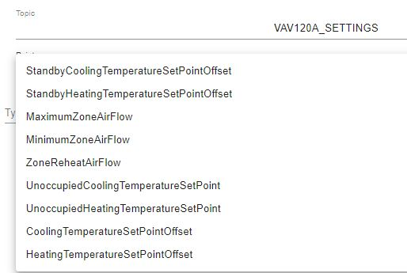

Example: Topic is set to *METERS*

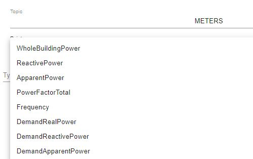

**Type**

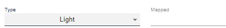

Depending on the chosen type (*AHU*, *Light*, and *VAV*), the *Mapped* dropdown
will defer.

**Output Configuration**

Below the Type option there are various different tabs to configure.

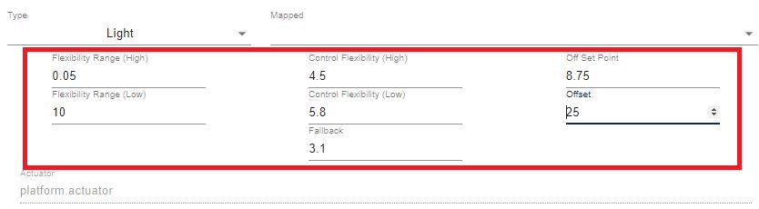

Each tab takes in a float value. 

**Actuator**

Actuator is displayed below the Output configuration tabs. This is hard coded into the 
application so it cannot be changed. 

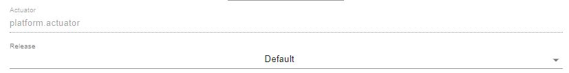

Below the Actuator, there is a dropdown to chose from. The dropdown will 
give a list between *default* and *None*. 

Schedule
********

Schedule is the last page of the TCC application. 

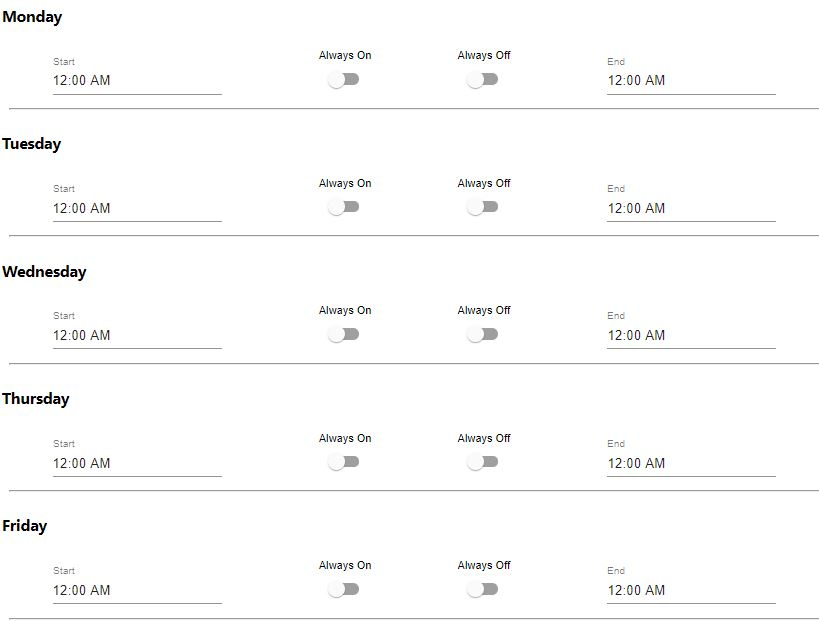

This page has every day of the week listed (mon-sun).
on each tab there is a *Start* time, an *always on* button, an *always off*
button, and an *End* time. 

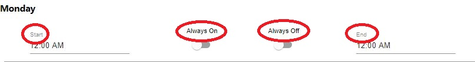

**Clock**

When the *Start* and *End* tabs are selected, a pop up of a clock will appear
to select the correct time needed. 

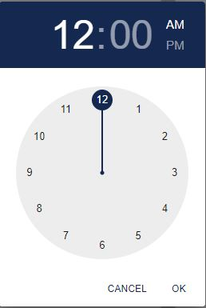

**Always off/on**

The buttons for always off and always on determine which days of the week
will be *Always on* or *Always off*. 

.. Note:: When an icon is selected, and another is selected, the previous icon
   will return back to its previous state. They can both be off, but both cannot be on.

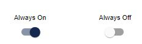

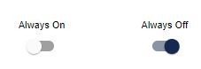

Settings
********

**Dark Mode** : There is an option for this document to be used in dark mode. Click the *Contrast* icon on the top right corner of the page to toggle this option. 

